<div align="center">

<picture>
  <source media="(prefers-color-scheme: dark)" srcset="assets/hero-dark.svg">
  
</picture>

**EN** · [RU](README.ru.md)

</div>

## // about

**Core engineer.** I build the parts products stand on — core services, protocol internals
and the integrations everything else plugs into: gRPC APIs, network stacks, document
pipelines and infrastructure for AI agents.

```
now      core engineer on an AI project — core services & agent infrastructure
also     one of the lead developers on a VPN project — Amnezia + Xray + WireGuard
ships    MCP servers that give LLMs real-world capabilities
tools    Claude Code control centers, desktop session editors
digs     systems design, protocol internals, secure networking
```

## // stack

<div align="center">

<picture>
  <source media="(prefers-color-scheme: dark)" srcset="assets/stack-dark.svg">
  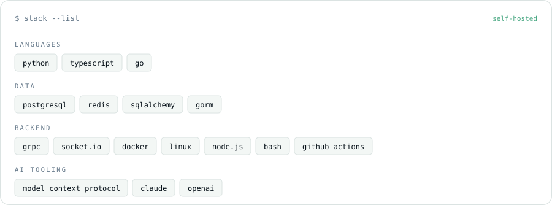
</picture>

</div>

## // projects

<table>
<tr>
<td width="50%">
<a href="https://github.com/ex3lite/claude-configurator">
<picture>
  <source media="(prefers-color-scheme: dark)" srcset="assets/cards/claude-configurator-dark.svg">
  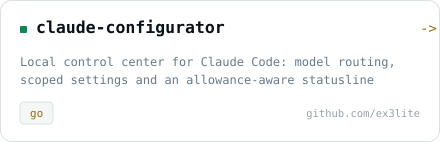
</picture>
</a>
</td>
<td width="50%">
<a href="https://github.com/ex3lite/Dota2_Workshop_MCP">
<picture>
  <source media="(prefers-color-scheme: dark)" srcset="assets/cards/Dota2_Workshop_MCP-dark.svg">
  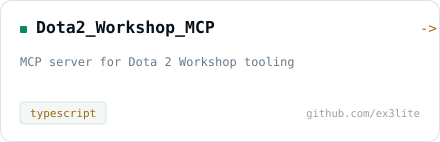
</picture>
</a>
</td>
</tr>
<tr>
<td width="50%">
<a href="https://github.com/ex3lite/codex-chat-editor">
<picture>
  <source media="(prefers-color-scheme: dark)" srcset="assets/cards/codex-chat-editor-dark.svg">
  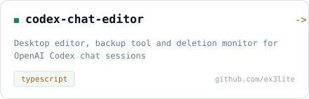
</picture>
</a>
</td>
<td width="50%">
<a href="https://github.com/ex3lite/chatgpt-web-image-mcp">
<picture>
  <source media="(prefers-color-scheme: dark)" srcset="assets/cards/chatgpt-web-image-mcp-dark.svg">
  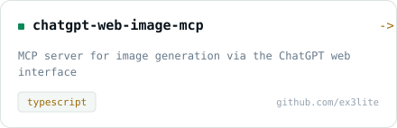
</picture>
</a>
</td>
</tr>
<tr>
<td width="50%">
<a href="https://github.com/ex3lite/mcp_rzd_tickets">
<picture>
  <source media="(prefers-color-scheme: dark)" srcset="assets/cards/mcp_rzd_tickets-dark.svg">
  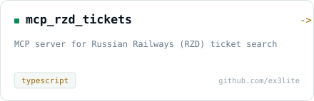
</picture>
</a>
</td>
<td width="50%">
<a href="https://github.com/ex3lite/pyraycore">
<picture>
  <source media="(prefers-color-scheme: dark)" srcset="assets/cards/pyraycore-dark.svg">
  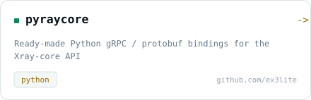
</picture>
</a>
</td>
</tr>
</table>

## // activity

<table>
<tr>
<td width="50%">
<picture>
  <source media="(prefers-color-scheme: dark)" srcset="assets/stats-dark.svg">
  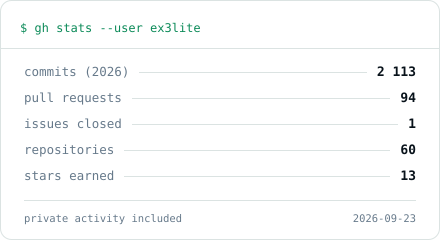
</picture>
</td>
<td width="50%">
<picture>
  <source media="(prefers-color-scheme: dark)" srcset="assets/langs-dark.svg">
  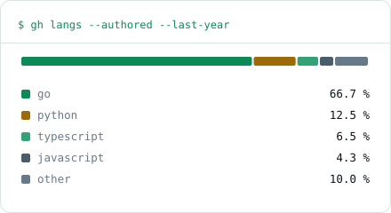
</picture>
</td>
</tr>
</table>

<div align="center">

<picture>
  <source media="(prefers-color-scheme: dark)" srcset="assets/heatmap-dark.svg">
  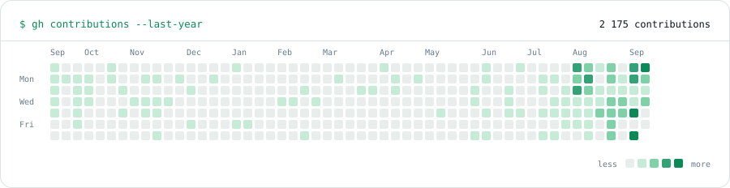
</picture>

</div>

## // contact

<div align="center">

<a href="https://t.me/SHARASHKABRK"><picture><source media="(prefers-color-scheme: dark)" srcset="assets/btn-telegram-dark.svg"></picture></a> <a href="https://github.com/ex3lite"><picture><source media="(prefers-color-scheme: dark)" srcset="assets/btn-github-dark.svg"></picture></a>

<picture>
  <source media="(prefers-color-scheme: dark)" srcset="assets/footer-dark.svg">
  
</picture>

</div>
